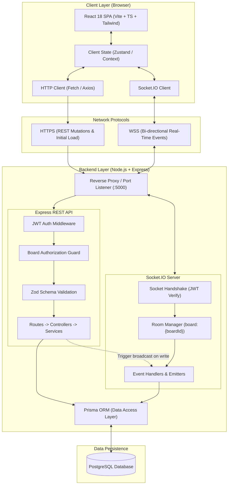
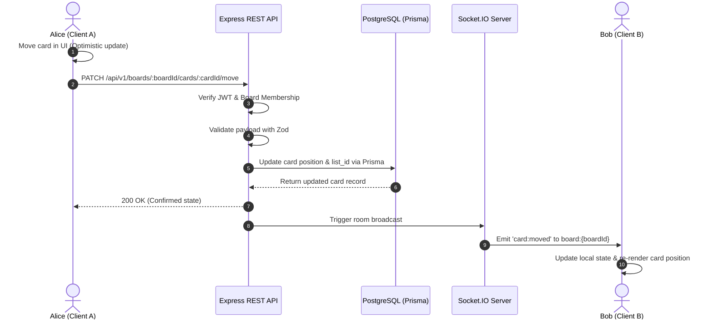

# System Architecture: Real-Time Collaborative Kanban Board

## 1. Overview

The Real-Time Collaborative Kanban Board is built as a decoupled client-server architecture designed for rapid synchronization, strong type safety, and efficient deployment on free-tier infrastructure. The system leverages:
- **Client**: Single Page Application (SPA) built with React 18, Vite, TypeScript, and Tailwind CSS.
- **Backend**: Monolithic Node.js service hosting an Express HTTP REST API and a Socket.IO WebSocket server in the same process.
- **Database**: PostgreSQL accessed via Prisma ORM for relational integrity, schema migrations, and type-safe query execution.

---

## 2. High-Level Architecture Diagram

The diagram below illustrates the end-to-end topology, data flow, and network boundaries:



---

## 3. Communication Patterns

### 3.1 Dual-Channel Communication Model

The application employs a hybrid communication strategy:
1. **REST API (HTTP/JSON)**: Used for stateless operations, resource creation, authentication, bulk reads (board canvas initial load), and operations requiring strict request-response semantics.
2. **Socket.IO (WebSocket with HTTP Long-Polling fallback)**: Used for instantaneous state synchronization, room-scoped mutation broadcasting, and live user presence.

| Channel | Purpose | Authentication | Authorization |
| :--- | :--- | :--- | :--- |
| **REST (HTTP)** | User auth, board listing, initial canvas load, CRUD mutations | `Authorization: Bearer <token>` | Route middleware checks board membership/role in database |
| **Socket.IO (WS)** | `board:join`, `board:leave`, mutation notifications, presence | Handshake `auth.token` verified on connection | Handshake rejects invalid tokens; room join verifies board membership |

### 3.2 Room Isolation Pattern

Socket.IO connections are grouped into isolated rooms by board ID:
- Room identifier: `board:{boardId}`
- When a user navigates to `/boards/:boardId`, the client emits `board:join { boardId }`.
- The server validates that the authenticated socket user is an active member or owner of the board.
- Broadcasts are dispatched exclusively to the board room (`socket.to('board:' + boardId).emit(...)`), preventing cross-tenant data leaks and unnecessary network fan-out.

---

## 4. End-to-End Data Flow

### 4.1 Mutation Lifecycle (Optimistic Update & Sync)



If the REST mutation fails (e.g., validation error, database disconnect, or permission revocation):
1. The REST API returns an error response (`400`, `403`, or `500`).
2. Client A catches the error, rolls back its optimistic state to the previous snapshot, and displays an actionable error banner.
3. No socket event is emitted to Client B, preserving consistency across all clients.

### 4.2 Presence & Disconnect Lifecycle

1. **Join**: User connects and emits `board:join`. Server adds socket to `board:{boardId}` and broadcasts `presence:update` to existing room members.
2. **Card Inspection**: User opens a card detail modal. Client emits `presence:update` with `{ cardId: "card-123", status: "editing" }`. Collaborators see Alice's avatar badge on that card.
3. **Graceful Leave**: When user navigates away, client emits `board:leave`. Server removes socket and broadcasts updated presence list.
4. **Ungraceful Drop**: If the network disconnects or browser tab terminates abruptly, Socket.IO's heartbeat detector triggers the `disconnect` event on the server within 3 seconds, cleaning up the socket from the room and broadcasting the revised presence list.

---

## 5. Backend Layering & Code Organization

Following `RULES.md`, the backend strictly enforces separation of concerns across four discrete layers:

```
server/src/
├── routes/          # Express route definitions, HTTP method bindings, middleware mounting
├── middlewares/     # JWT authentication, board authorization guards, error handlers
├── controllers/     # Request parsing, HTTP status resolution, controller-level coordination
├── services/        # Pure business logic, authorization rules, transaction orchestration
├── schemas/         # Zod schemas for request body/query and socket payload validation
├── sockets/         # Socket.IO connection handlers, room subscriptions, presence tracking
└── prisma/          # Prisma schema, client singleton, database migrations
```

1. **Routes**: Define URL paths and attach route-level middleware (`authenticateJwt`, `requireBoardMember`).
2. **Controllers**: Extract parameters from `req.params`, `req.body`, and `req.user`, invoke the appropriate service method, and format the HTTP response.
3. **Services**: Execute domain logic, enforce data rules (such as midpoint position calculations), invoke Prisma transactions, and call socket broadcast helpers.
4. **Prisma Client**: Direct type-safe database queries.

---

## 6. Security Architecture

1. **Authentication**:
   - Passwords hashed with bcrypt using a salt round of 10.
   - JWT tokens signed with a 256-bit secret key (`JWT_SECRET`), expiring in 7 days.
2. **Authorization**:
   - Every protected REST endpoint executes a board authorization middleware verifying that `req.user.id` is present in `BoardMember` for the targeted `boardId`.
   - Modifying board metadata, deleting boards, or managing members requires role `OWNER`.
   - Creating, editing, or moving cards and lists requires role `OWNER` or `MEMBER`.
3. **Socket Security**:
   - Socket handshake verifies the JWT token passed in `socket.handshake.auth.token`.
   - Handshake fails with an authorization error if the token is invalid or expired.
   - Every socket event (`board:join`, `presence:update`) re-checks board membership prior to room admission.
4. **Input Sanitization & Validation**:
   - All REST bodies and socket payloads are validated against strict Zod schemas with unexpected properties stripped.

---

## 7. Free-Tier Deployment Strategy

The architecture is deliberately structured to run seamlessly on free-tier cloud platforms without exceeding resource caps:
- **Client**: Static SPA bundle hosted on Vercel, Netlify, or Cloudflare Pages (free global CDN distribution).
- **Server**: Single Node.js instance on Render, Railway, or Fly.io (Express HTTP + Socket.IO co-hosted on port 5000; WebSockets supported natively).
- **Database**: Serverless PostgreSQL database on Neon, Supabase, or Render (free compute and storage with connection pooling).
- **Zero In-Memory Cache Dependency**: Active board presence is tracked in server process memory per board room, eliminating the need for paid Redis clusters during single-instance operation.
