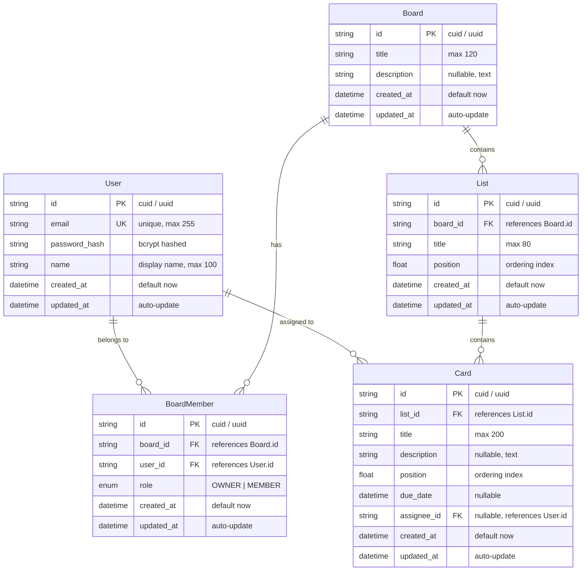
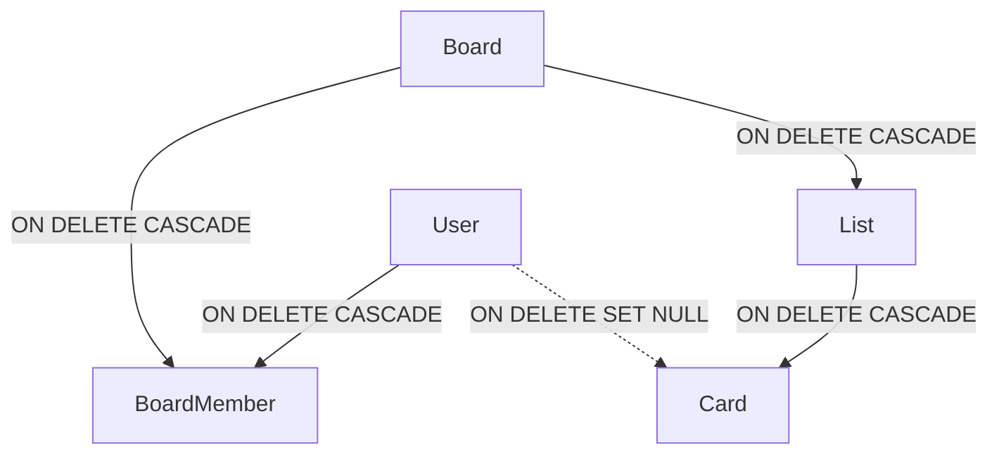

# Database Design: Real-Time Collaborative Kanban Board

## 1. Overview

The persistence layer is built on PostgreSQL and managed via Prisma ORM. The schema is normalized into five core models:
1. `User`: Registered application users.
2. `Board`: Kanban boards created and owned by users.
3. `BoardMember`: Join table defining user access and roles (`OWNER` or `MEMBER`) per board.
4. `List`: Columns within a board, ordered by a floating-point `position`.
5. `Card`: Work items within a list, ordered by a floating-point `position` via midpoint insertion.

---

## 2. Entity-Relationship (ER) Diagram

The following Mermaid diagram defines all entities, attributes, primary/foreign keys, and relational cardinalities:



---

## 3. Detailed Data Models

### 3.1 `User`
Stores credentials and identity attributes.
- `id` (`String` / `PK`): Unique identifier (`cuid`).
- `email` (`String` / `Unique`): Lowercase email address for authentication.
- `password_hash` (`String`): Bcrypt salted password hash.
- `name` (`String`): Human-readable display name.
- `created_at` (`DateTime`): Timestamp of account creation.
- `updated_at` (`DateTime`): Timestamp of last modification.

### 3.2 `Board`
Represents an individual Kanban workspace.
- `id` (`String` / `PK`): Unique identifier (`cuid`).
- `title` (`String`): Board title (1–120 characters).
- `description` (`String?`): Optional descriptive text.
- `created_at` (`DateTime`): Creation timestamp.
- `updated_at` (`DateTime`): Last modified timestamp.

### 3.3 `BoardMember`
Enforces multi-user collaboration and role-based permissions per board.
- `id` (`String` / `PK`): Unique identifier (`cuid`).
- `board_id` (`String` / `FK`): References `Board.id`.
- `user_id` (`String` / `FK`): References `User.id`.
- `role` (`Role` enum):
  - `OWNER`: Full administrative rights (metadata edits, member invitations/removals, board deletion, list/card CRUD).
  - `MEMBER`: Collaborative rights (list/card CRUD, self-removal).
- Unique Constraint: `@@unique([board_id, user_id])` prevents duplicate memberships.

### 3.4 `List`
Represents vertical columns/workflow stages on a board.
- `id` (`String` / `PK`): Unique identifier (`cuid`).
- `board_id` (`String` / `FK`): References `Board.id`.
- `title` (`String`): List title (1–80 characters).
- `position` (`Float`): Floating-point sorting index relative to other lists on the board.
- Composite Index: `@@index([board_id, position])` optimizes ordered retrieval of lists for a board.

### 3.5 `Card`
Represents individual tasks inside a list.
- `id` (`String` / `PK`): Unique identifier (`cuid`).
- `list_id` (`String` / `FK`): References `List.id`.
- `title` (`String`): Task title (1–200 characters).
- `description` (`String?`): Optional task details (Markdown text).
- `position` (`Float`): Floating-point sorting index relative to other cards in the same list.
- `due_date` (`DateTime?`): Optional task deadline.
- `assignee_id` (`String?` / `FK`): Optional reference to `User.id`.
- Composite Index: `@@index([list_id, position])` optimizes ordered retrieval of cards within a list.

---

## 4. Ordering Strategy: Midpoint Insertion

### 4.1 The Reordering Problem
In a traditional integer-index system (`position = 0, 1, 2, ...`), moving a card from position 10 to position 1 requires updating the position of cards 1 through 9. This triggers an $O(N)$ database write, generates heavy row-locking contention, and floods the network with multiple update events.

### 4.2 Fractional Floating-Point Indexing
Using a floating-point `position` field, reordering any item is an **$O(1)$ single-row update**. The new position is computed as the midpoint between the surrounding items:

$$\text{position}_{\text{new}} = \frac{\text{position}_{\text{prev}} + \text{position}_{\text{next}}}{2}$$

### 4.3 Position Calculation Rules

| Insertion Case | Preceding Card (`pos_prev`) | Subsequent Card (`pos_next`) | Formula | Example |
| :--- | :--- | :--- | :--- | :--- |
| **Empty list** | None | None | `1000.0` | Initial card gets `1000.0` |
| **Append to end** | Last card `pos` | None | `pos_prev + 1000.0` | Last is `2000.0` $\rightarrow$ new is `3000.0` |
| **Prepend to start** | None | First card `pos` | `pos_next / 2.0` | First is `1000.0` $\rightarrow$ new is `500.0` |
| **Insert between two** | Card A `pos` | Card B `pos` | `(pos_prev + pos_next) / 2.0` | Between `1000.0` and `2000.0` $\rightarrow$ `1500.0` |

### 4.4 Float Precision & Rebalancing Routine

IEEE 754 64-bit double-precision floats (`Float` in Prisma / PostgreSQL `double precision`) provide 53 bits of mantissa precision (~15–17 decimal digits). Repeated insertions between adjacent items will eventually reduce the gap $(\text{pos}_{\text{next}} - \text{pos}_{\text{prev}})$.

- **Threshold**: When $(\text{pos}_{\text{next}} - \text{pos}_{\text{prev}}) < 0.000001$ (`1e-6`):
- **Rebalance Routine**:
  1. Fetch all cards for the affected list, ordered by `position ASC`.
  2. In a single Prisma database transaction, reset each card's position to evenly spaced values:
     $$\text{position}_k = (k + 1) \times 1000.0$$
  3. Emit a single `list:rebalanced` or broadcast the refreshed card array to keep connected clients in sync.
- Because rebalancing occurs only after ~50 consecutive mid-point insertions in the exact same slot, normal usage rarely triggers this overhead.

---

## 5. Cascade Delete Strategy

The database enforces referential integrity through explicit cascading rules:



### 5.1 Deletion Cascade Rules

1. **Board Deletion (`Board -> onDelete: Cascade`)**:
   - Deleting a `Board` permanently deletes all associated `BoardMember` records.
   - Deleting a `Board` permanently deletes all child `List` records.
   - Deleting child `List` records in turn triggers cascading deletion of all `Card` records in those lists.
   - **Result**: No orphaned memberships, lists, or cards remain in the database.

2. **List Deletion (`List -> onDelete: Cascade`)**:
   - Deleting a `List` cascades directly to all `Card` records where `list_id == List.id`.
   - **Result**: Cards cannot exist without an active parent list.

3. **User Deletion (`User -> onDelete: Cascade / SetNull`)**:
   - If a user account is deleted, their `BoardMember` entries are deleted via `Cascade`.
   - Cards assigned to that user have `assignee_id` updated to `NULL` via `SetNull`, preserving the card and its history on the board while removing the dangling user reference.
   - Note: A board owner cannot be deleted until board ownership is transferred or the board is deleted.

---

## 6. Complete Prisma Schema (`schema.prisma`)

```prisma
datasource db {
  provider = "postgresql"
  url      = env("DATABASE_URL")
}

generator client {
  provider = "prisma-client-js"
}

enum Role {
  OWNER
  MEMBER
}

model User {
  id            String        @id @default(cuid())
  email         String        @unique @db.VarChar(255)
  passwordHash  String        @map("password_hash") @db.VarChar(255)
  name          String        @db.VarChar(100)
  createdAt     DateTime      @default(now()) @map("created_at")
  updatedAt     DateTime      @updatedAt @map("updated_at")

  memberships   BoardMember[]
  assignedCards Card[]        @relation("CardAssignee")

  @@map("users")
}

model Board {
  id          String        @id @default(cuid())
  title       String        @db.VarChar(120)
  description String?       @db.Text
  createdAt   DateTime      @default(now()) @map("created_at")
  updatedAt   DateTime      @updatedAt @map("updated_at")

  members     BoardMember[]
  lists       List[]

  @@map("boards")
}

model BoardMember {
  id        String   @id @default(cuid())
  boardId   String   @map("board_id")
  userId    String   @map("user_id")
  role      Role     @default(MEMBER)
  createdAt DateTime @default(now()) @map("created_at")
  updatedAt DateTime @updatedAt @map("updated_at")

  board     Board    @relation(fields: [boardId], references: [id], onDelete: Cascade)
  user      User     @relation(fields: [userId], references: [id], onDelete: Cascade)

  @@unique([boardId, userId])
  @@index([userId])
  @@map("board_members")
}

model List {
  id        String   @id @default(cuid())
  boardId   String   @map("board_id")
  title     String   @db.VarChar(80)
  position  Float
  createdAt DateTime @default(now()) @map("created_at")
  updatedAt DateTime @updatedAt @map("updated_at")

  board     Board    @relation(fields: [boardId], references: [id], onDelete: Cascade)
  cards     Card[]

  @@index([boardId, position])
  @@map("lists")
}

model Card {
  id          String    @id @default(cuid())
  listId      String    @map("list_id")
  title       String    @db.VarChar(200)
  description String?   @db.Text
  position    Float
  dueDate     DateTime? @map("due_date")
  assigneeId  String?   @map("assignee_id")
  createdAt   DateTime  @default(now()) @map("created_at")
  updatedAt   DateTime  @updatedAt @map("updated_at")

  list        List      @relation(fields: [listId], references: [id], onDelete: Cascade)
  assignee    User?     @relation("CardAssignee", fields: [assigneeId], references: [id], onDelete: SetNull)

  @@index([listId, position])
  @@index([assigneeId])
  @@map("cards")
}
```
